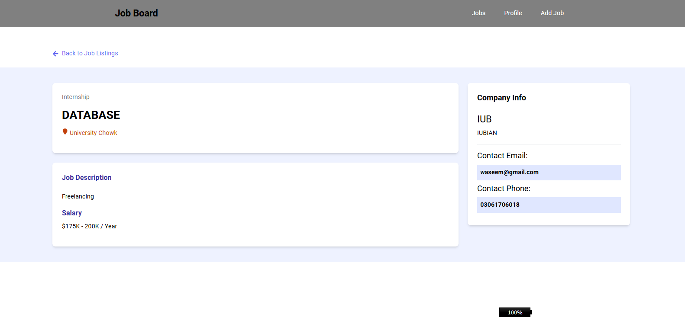
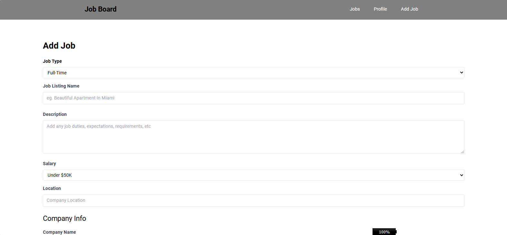

      <h1>  React Job Portal</h1>

    
    
    

# Tech Used

A modern job portal application built with React and Firebase, featuring job listings, user authentication, and admin capabilities.

## 🔴 Live Demo

Check out the live demo: [https://job-portal-jamalihassan0307.web.app](https://job-portal-jamalihassan0307.web.app)

## 📸 Screenshots

### User Journey

#### 1. Authentication

_Secure user authentication interface for accessing the portal_

#### 2. Home Page

_Landing page showcasing featured job opportunities and quick search_

#### 3. Jobs Listing

_Comprehensive job board with advanced search and filtering options_

#### 4. Job Details

_In-depth view of job postings with application options_

#### 5. Admin Dashboard

_Powerful admin interface for managing job listings and user accounts_

#### 6. Add Job

_Interface for posting new job listings_

#### 7. Profile Management

_User profile management interface_

#### 8. Job Loading State

_Smooth loading transitions between job views_

## 🚀 Features

- **User Authentication**

  - Secure login system
  - Role-based access control (Admin/User)
  - Protected routes

- **Job Management**

  - Browse job listings
  - Search and filter jobs
  - Add new job listings (Admin)
  - Edit existing jobs (Admin)
  - Delete job postings (Admin)

- **User Interface**

  - Responsive design
  - Modern UI with Tailwind CSS
  - Interactive components
  - Toast notifications

- **Profile Management**
  - User profile viewing
  - Profile editing
  - Role-based permissions

## 🛠️ Built With

- **Frontend Framework**

  - React.js
  - Vite (Build tool)

- **Styling**

  - Tailwind CSS
  - React Icons

- **State Management & Routing**

  - React Router DOM
  - Local Storage

- **Backend & Hosting**

  - Firebase Hosting
  - MockAPI (for development)

- **Additional Libraries**
  - Axios (API calls)
  - React Toastify (Notifications)
  - React Spinners (Loading states)

## 🚀 Getting Started

1. Clone the repository

## 🙏 Acknowledgments

- [React](https://reactjs.org/)
- [Vite](https://vitejs.dev/)
- [Tailwind CSS](https://tailwindcss.com/)
- [Firebase](https://firebase.google.com/)
- [MockAPI](https://mockapi.io/)

## 📝 License

This project is licensed under the MIT License - see the [LICENSE.md](LICENSE.md) file for details.
